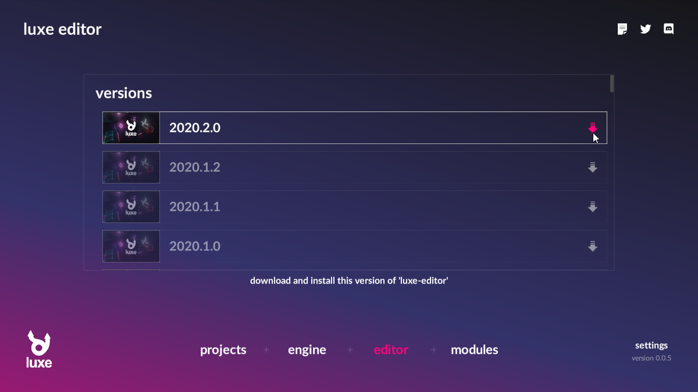
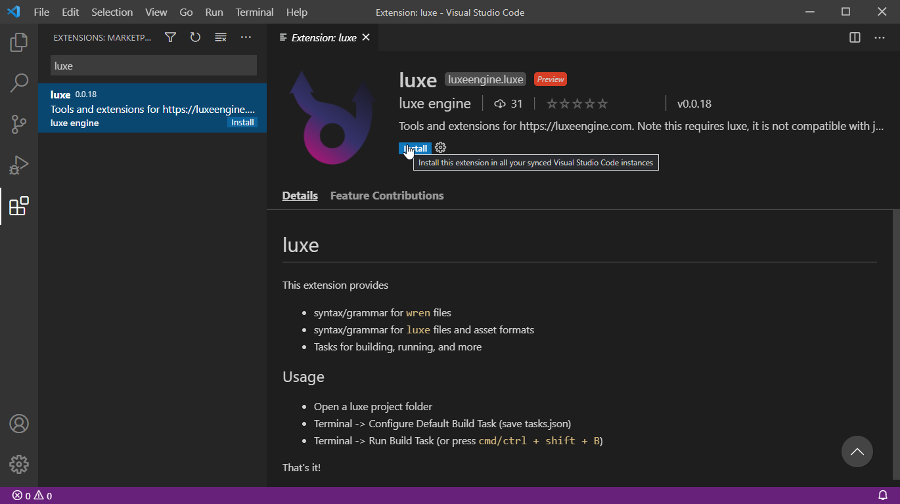

# Install

## Installing luxe itself
- Get the luxe launcher from itch.io
- Run the launcher, it'll offer to install the latest luxe version
- You can view other versions in the `engines` page

{width="75%"}

## Installing the editor
Using the luxe editor isn't required.   
If you plan to use the editor, you should install it:

- Visit the `editors` page of the launcher
- Click the download button for the matching luxe version

{width="75%"}

## Installing IDE support

Currently the primary supported IDE is [Code](https://code.visualstudio.com/).   
It's a free cross platform editor with great support for custom extensions.

Download and install Code from the above link for your platform.

To install support for luxe, open the extensions panel.   
This can be found via the menu or the side bar.

{width="75%"}

Search the extensions for 'luxe' and when found, select 'install'.   
This will install all the parts needed to use luxe.

!!! note "" 
    Double check that it's the official one from 'luxe engine'.

{width="75%"}
