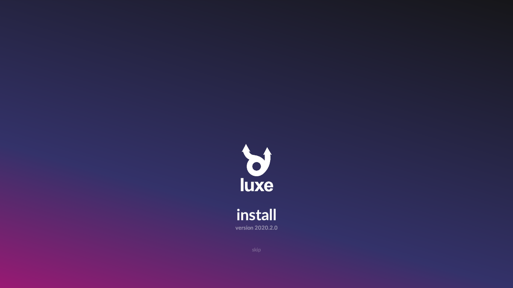
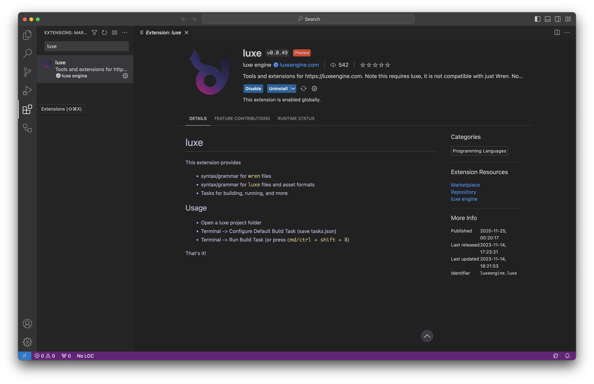

# Install

## Installing luxe
- Get the luxe launcher from [the preview forum thread](https://community.luxeengine.com/t/welcome-to-the-luxe-closed-preview-read-this/276)
- Run the launcher, it'll offer to install the latest version
- This will install the engine, editor and agent

{width="75%"}

- Progress will be shown under the install button
  
{width="75%"}

- After installing, you should see this
  
{width="75%"}

- Once you've created or added projects, it will look like this

{width="75%"}

## Installing IDE support

Currently the primary supported IDE is [Visual Studio Code](https://code.visualstudio.com/).   
It's a free cross platform editor with great support for custom extensions.
The extension includes features like code completion, jump to definition, and so on.

!!! note "Install Visual Studio Code" 
    Download and install Visual Studio Code from the above link for your platform if you haven't.

To install support for luxe, open the extensions panel. 
This is an icon on the side bar, or found via the `View -> Extensions` menu.  

Search the extensions for 'luxe' and when found, select 'install'.   
_(Make sure it's the official one)_. [View the extension in the marketplace.](https://marketplace.visualstudio.com/items?itemName=luxeengine.luxe).

{width="75%"}
