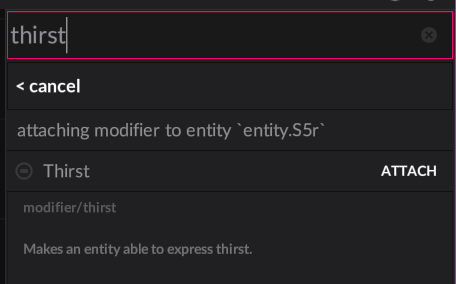
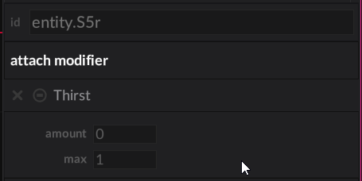

{width="96em"}

# Custom modifiers

Typically, **modifiers are where you'll write a majority of your gameplay code**.
Naturally, that means you need to be able to add modifiers of your own to the mix.
These modifiers become available in the editor, and can be used from code to
combine and create complex behaviours in a modular way.

!!! note ""
    The modifiers have been rewritten and are just now landing in 2024.x.
    This means there may be bugs, gaps or other mysteries. Please let
    us know if you run into unexpected behaviour!

Modifiers exist in a world, and there is **one system per world** for a modifier type.
A modifier system in a world will see and modify ALL entities that have the modifier attached.
This is a little different from a 1:1 relationship, and enables gameplay code to be expressive
about multiple things at once easily, but will still be familiar as you typically are still operating per entity.

As an example, a door modifier will be attached to 20 entities in a world, but in that world 
there is only one door modifier system running. **That system knows about all doors** in that world, and 
can answer questions like how many doors are open, without a lot of effort or looping or searching.

Modifiers can also run custom code in the editor, allowing custom behaviour between editor and the game.

## Making a modifier

### Step 1. A modifier.wren file

A modifier is a script asset with a `modifier` subtype. To make a door modifier,
you would make a file named `door.modifier.wren` in your project, typically inside
a `system/door.modifier.wren` by convention.

This file contains three important pieces that we'll get into below:

  - A description of your system **data** per entity
  - A user facing **API** for your system
  - The **system** implementation

Take a look at the example below:

```wren
#block = data
class Data {
  var locked: Bool = false
}

#api
#desc = "**A door**. Can be locked or unlocked."
#keywords(door, entrance, lock)
class Door is API {
  static unlock(entity: Entity) {
    get(entity).locked = false
  }
}

#system
#phase(on, tick)
class System is Modifier {

  construct new(world: World) { super(world) }

  attach(entity: Entity, door: Data) {
    Log.print("attached to entity `%(entity)` - locked? %(door.locked)")
  }

  detach(entity: Entity, door: Data) {
    Log.print("detached from `%(entity)`")
  }

  tick(delta: Num) {
    each {|entity: Entity, door: Data|
      //use door.*
    } 
  }
  
}
```

!!! note ""
    Currently there's a `door.modifier.api.wren` generated for your system alongside it, this 
    is a temporary generated file and won't stay long term.

## Use via editor

If you save your file and re-open your project in the editor (it's not able to hot reload at the moment).
Once opened, on an entity you can select attach and see your Door modifier is now available.



And if attached, will show up in omni along with the other modifiers below the scene outline.



## Use via code 

To use the modifier in code, you import the API class from the modifier id. Ours was called
`system/door.modifier.wren` which makes the modifier id `system/door.modifier`.

```wren
import "system/door.modifier" for Door

...

var door = Entity.create("door")
Door.create(door)
Door.unlock(door)
```

## Data field types

!!! note "Docs WIP"
    These will get documented nicely, but here is a dump of the types and examples available
    to systems. Some of these have rough edges and will change slightly (nothing major).


```wren
#block = data
class Data {

  #display = "Number (count)"
  var number : Num = 11
  #display = "name"
  var string : String = "luxe" 
  var enum : MyTextAlign = MyTextAlign.bottom //defined below
  var uuid : UUID = null
  var link : Link = null //a reference to an entity in the editor/scene
  var color : Color = [1,1,1,1]
  var float2 : Float2 = [1,1]
  var float3 : Float3 = [1,1,1]
  var float4 : Float4 = [1,1,1,1]
  var boolean : Bool = true
  
  //Arrays
  
  //They have a count for efficiency,
  //the count isn't a limit. It's how much
  //space to reserve for your common use case,
  //which will make operating on this field faster.

  //For now, we specify the type as a tag on the field,
  //this will be improved later.
  //Any primitive array can have a default

  #count = 4
  #type = Num
  var array_number : List = [22, 33, 44, 55]

  #count = 2
  #type = MyTextAlign
  var array_enum : List = [MyTextAlign.center]

  //No defaults for objects here, 
  //defaults are defined in the object itself
  var obj : Obj = Object
  
  //Arrays of objects are valid too,
  //and they work similarly, they can't
  //have a default here. The list can 
  //have an empty default though

  #count = 1
  #type = Obj
  var obj_array : List = []

}

//option tag is required
#option
class MyTextAlign {
  static left { "left" }
  static center { "center" }
  static right { "right" }
  static top { "top" }
  static bottom { "bottom" }
}

//Objects have the same types as above
class Obj {
  var other: Num = 1
  var some: String = "fields"
  var here: Color = [111,112,113,114]
  var yea: Float2 = [11, 12]
}
```


To be continued...
