{width="96em"}

# Using tilemaps

In this tutorial we'll:

- Import a tile sheet
- Create a tile map
- Use that tile map in the world
- Add collision to it using the Arcade modifier

**Assets**

**This tutorial is using the [kenney 1 bit asset pack](https://www.kenney.nl/assets/bit-pack).** 
You can copy paste it ready to use from the `kenney` module found in the luxe launcher modules page.

## tiles editor context

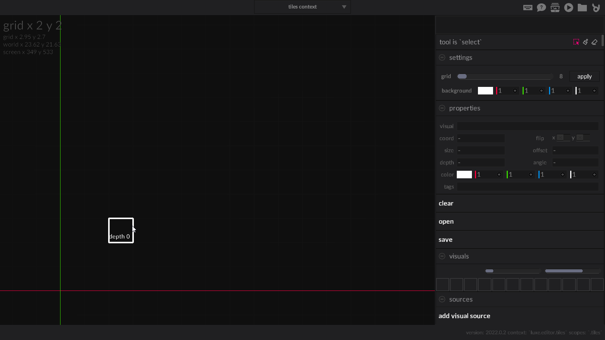

## import a tile sheet

To import a tile sheet, the **add visual source** button in the tiles context is our starting point.

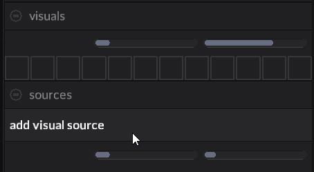

### visual source options

This presents two options:

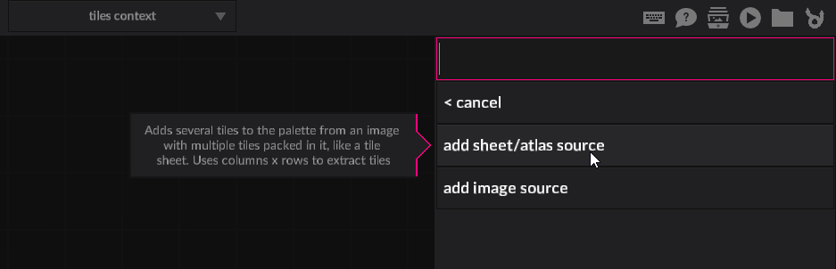

- **add sheet/atlas source** - This is a packed tilesheet, typically created in an external program and packed in a grid layout, with optional border padding and padding between tiles.
- **add image source** - In luxe, tiles can display "loose" images as well, so you can bring sprites into a tiles asset as well. This option is for defining a visual that points to a material.

For this tutorial, we'll pick the sheet one since as you can see in the preview at the start of this page, it's in a grid format.

### add sheet settings

This option shows us several things to input.

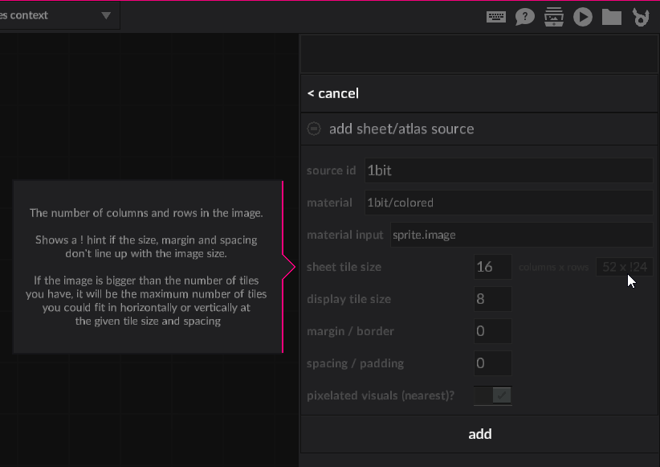

- **source id** - the identifier for the source we're creating. This is just a name for the source in the tilemap, that you decide. We'll use 1bit.
- **material** - a material that references your tilesheet image
- **material input** - not relevant unless you need it. leave it as default.
- **sheet tile size** - the size in pixels of the tiles inside the image. our tiles are 16x16 pixels in the sheet.
- **display tile size** - once we import a sheet, we'll want to display it in the grid with our tilemap alongside other tiles. Sometimes the tile size in the sheet doesn't match the size we're working at, like in this case we want to paint at 8x8 units in world space, rather than 16. *The default value here is set to the grid size of the tilemap, but you can display tiles at any size even if they don't match the grid.*
- **margin / border** - padding _around_ the image, in pixels. if there was one tile of `16x16` pixels, and a margin of `1px`, our image would be `1 + 16 + 1` = 18px wide. 
- **spacing / padding**: padding *between tiles*. With two `16x16` tiles and `1px` spacing, the image is `16 + 1 + 16` = 33px wide. The spacing is only *inside* never on the border of tiles. 
- **pixelated visuals**: whether or not to display the tiles as pixel art or not. A hint for the tile editor mainly, as the material actually controls the rendering.

If you look again at the image above, it shows `52 x !24` inside the columns x rows box. This is a hint that the image dimensions don't match the settings you've entered. *:todo: the plan is to display a live preview, so you can double check! This will come soon.* That's because our image has a spacing of 1 and a margin of 0, but we haven't entered the spacing. 

If we enter 1 for spacing you'll notice it shows 49x22. Kenney's tiles often come with a text file telling the settings, so we can confirm this in the assets. Now we can hit add and we're ready to go!

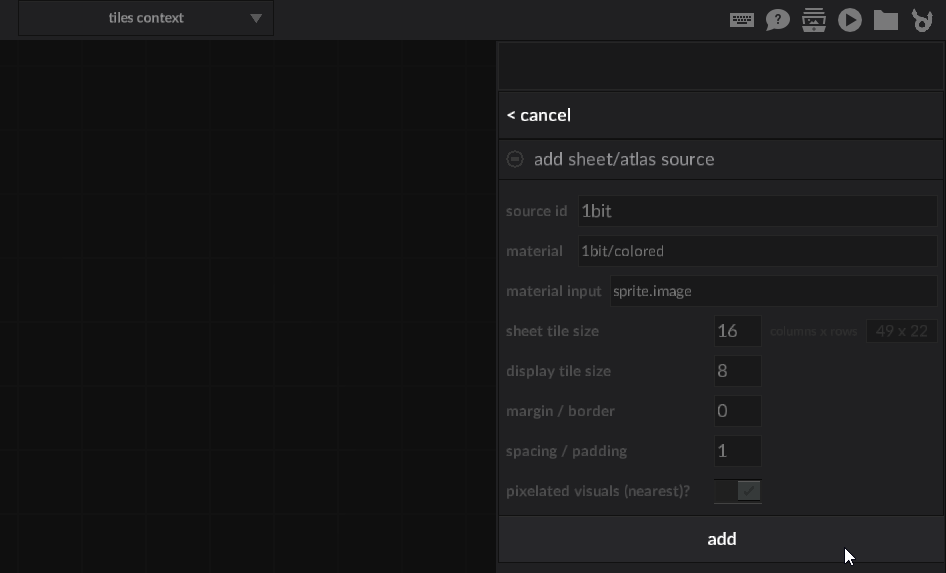

### visuals after import

Once you hit add, you should see a bunch of visuals added to the visuals panel. This is our palette to paint from, so we're ready to paint.

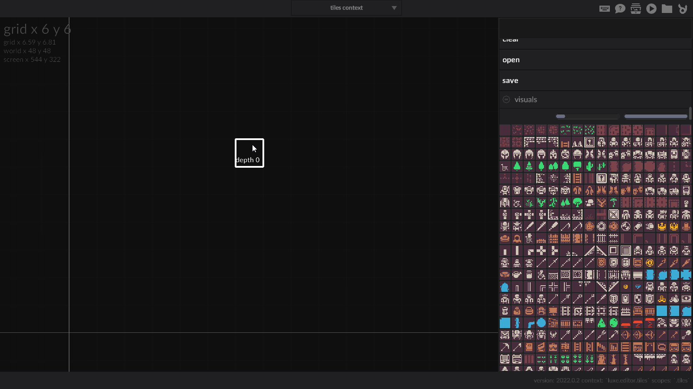

We can drag the sliders above the visuals, the left one controls the transparency behind the tiles between dark and bright, convenient when working with different tiles. The right hand slider controls the number of displayed visuals at once in the palette. *Note this ui is wip!* Here is it a bit zoomed in.

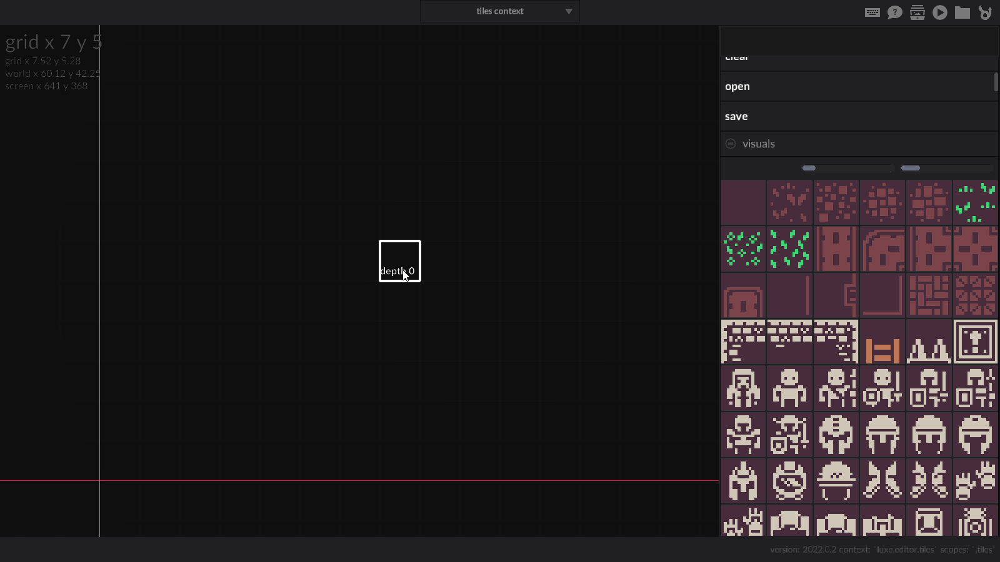

And here's another tilemap example, where the image isn't as wide (49 columns vs 8), sometimes you can line up the tiles as they are in the sheet, which let's you select multiple to paint as a single brush. *The brush based workflow will be improved soon to make this easier for wider tilesheets*.

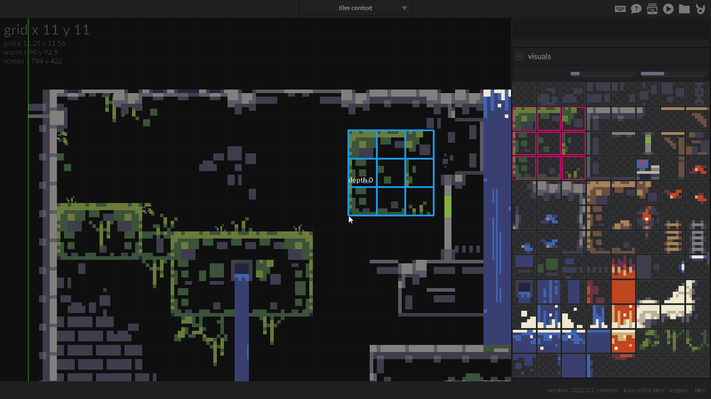

## painting tiles

### selecting a brush

To start painting tiles we'll switch to the brush tool. By default this is mapped to **B** key (select is **Q**, erase is **E**). 

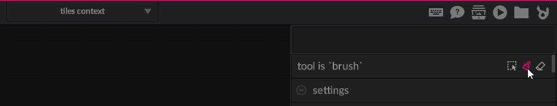

The second step is to select a brush from the palette. You click on a tile in the palette to select it, and hold shift to select multiple (typically useful when side by side or vertically aligned, as mentioned above).

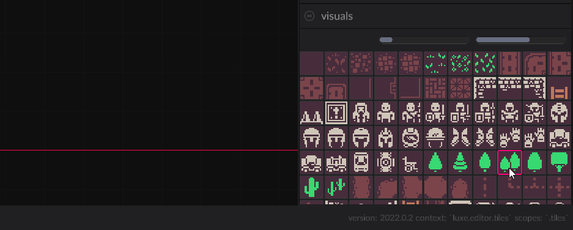

### painting with a brush

Once you have the brush tool active and a brush selected to paint with, when you move the cursor over the grid in the editor view, you'll see the tile attached to the mouse. It will snap to grid. 

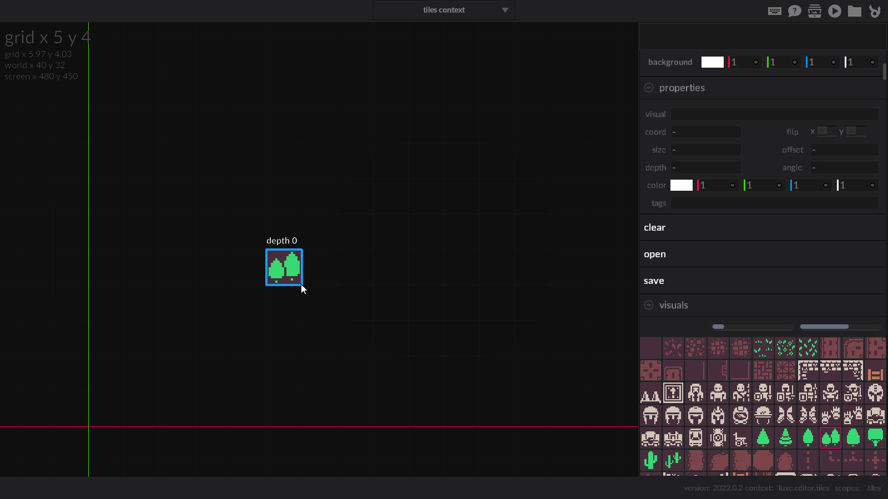

To paint you click on the grid. This will paint onto the current active depth layer, and once painted, you'll see the "tile stack", this shows you a list of tiles that are painted at this coordinate at the various layers.

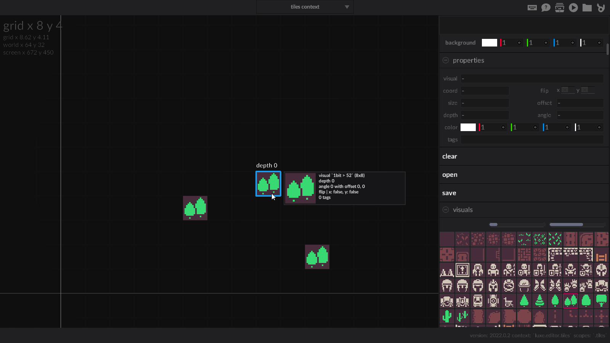

### the tile stack

Here you can see the stack shows multiple tiles at this coordinate, even if you can't see the ones underneath. This is most evident when the higher layers are transparent of course.

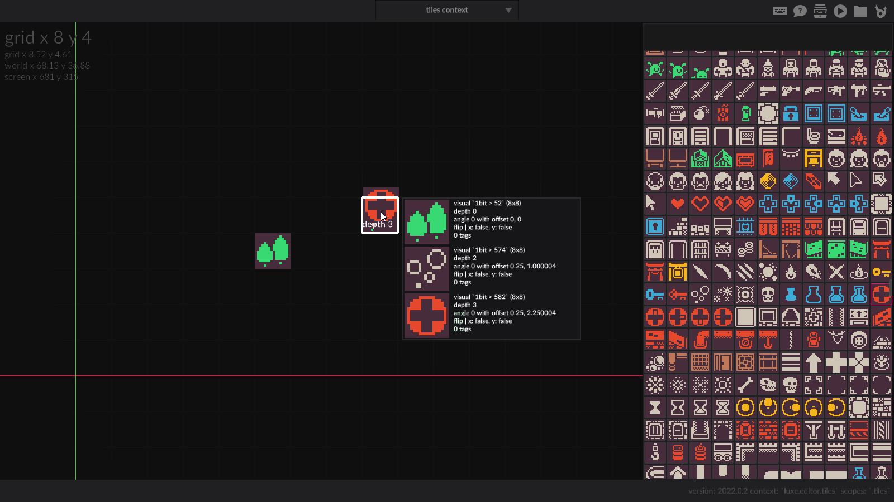

### selecting tiles

You can select tiles by clicking with the select tool. You can also hold **Alt** to select all layers at a coordinate.

Hold **Ctrl** and drag a rectangle to select a region:

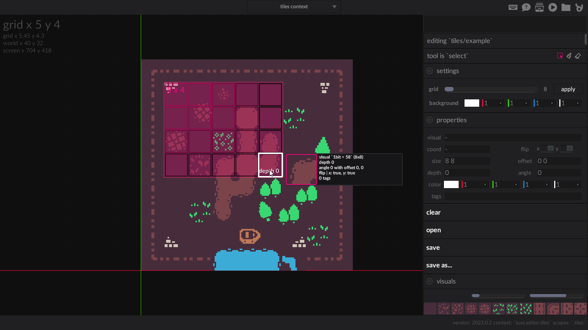

Hold **Ctrl + Alt** and **Right Click** to "select all of this visual". _note: several tools like this are coming to the side bar tool palette instead of obscure shortcuts soon._
This can be combined with **Shift** to add to the existing selection. (This makes it a bit easier to mark all of the same visual as solid until the brush palette allows saving brushes). Deselect to dismiss as normal.

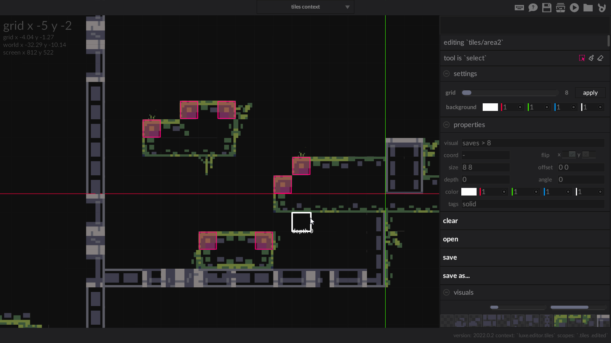

Hold **Ctrl** and **Right Click** to "highlight all of this visual". Highlights are useful to find stuff, but don't affect your selection, so you can mix them. Ctrl Right click to dismiss the highlights. Holding **Shift** will add to the existing highlight.

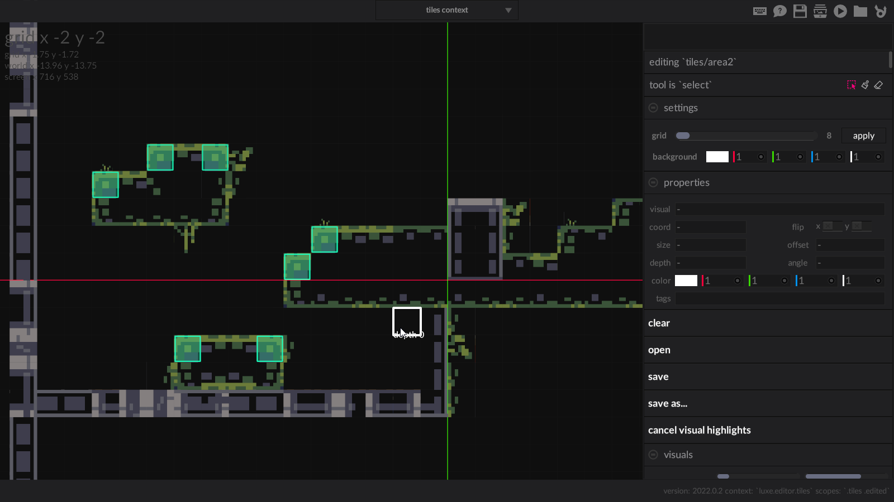

### save often

Generally a good practice, but save your tiles in your project as an asset. This asset is what we'll use later to display the tiles in our game.

### paint the tilemap!

Now the fun part. Paint the tilemap according to your needs. I've painted a quick 8x8 tilemap to show a few of the things you can do, with a list of notes below.

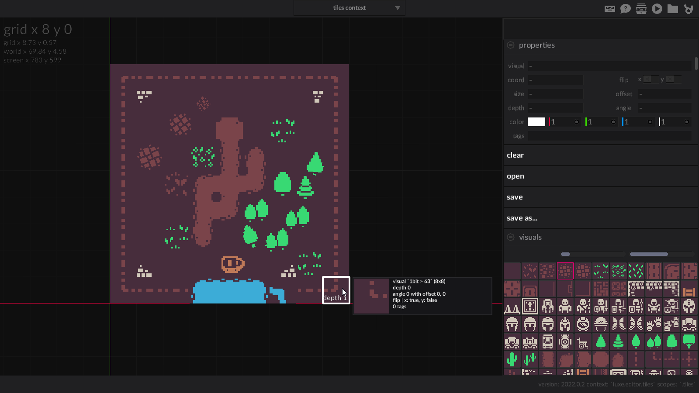

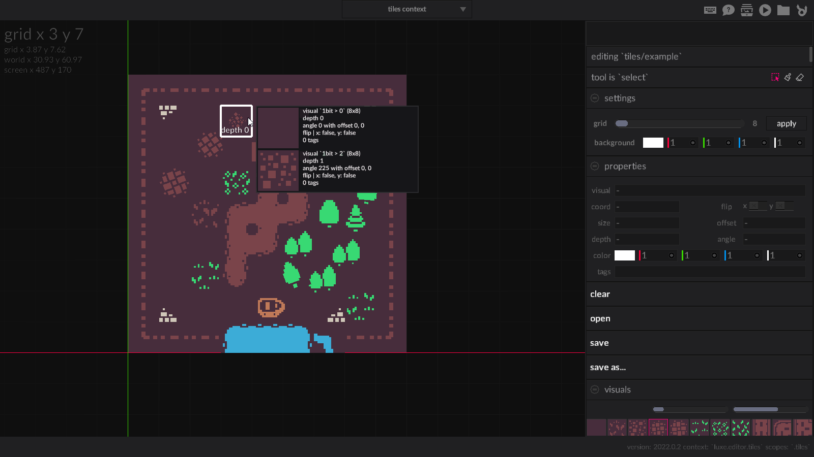

This tilemap shows the following:

- **Layers** - paint at multiple depth layers to add details. You can see the 'depth 0' at the cursor, this is the tool depth. Erasing, selecting or painting will operate at this layer when clicking. 
    - Scroll the **mouse wheel** to change the depth while painting, or press **W and S**, or **Up and Down** to change the depth as well. 
    - Holding **Alt** when doing many operations will operate on the entire stack, for example alt click with the select tool will select all layers.
- **Rotated tiles** - while painting, hold **R** to rotate the brush using the mouse. **Tap R** to reset the rotation. Hold **shift** while rotating to snap to 45 degree increments.
- **Tile sizes** - There's a few patches of ground near the top right, shown in the second image, where one is much smaller. This tile has it's size set to 4x4 instead of 8x8. This allows freedom from the grid for detailing.
- **Flip and rotate** - Tiles are shown that are flipped, vertically, horizontally, and combined with rotation means you only need to make a few tiles to get a wide range of combinations.
- **Tile offsets** - Holding **Alt** while painting will stop snapping to the grid, allowing you to paint a tile at the same coordinate, but offset from it. This also is for breaking up the monotony of the grid for details and can go a long way to making spaces feel less rigid. 
    - A single tile coordinate on a given depth layer, holds 1 tile. If your offset exceeds half the tile size, it will paint in the neighboring tile since. It's based on the grid, not the size of the visual.

## displaying tiles in a world

Now that we have a tiles asset, let's go display it in the world. We'll switch the to the world context now.

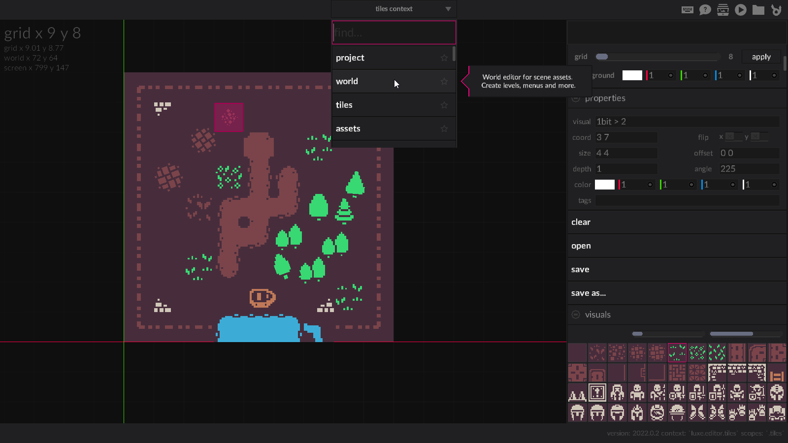

Like most things in luxe, we create an entity, and attach a modifier to give it a specific behaviour. In our case we want to display tiles, so we **attach a Tiles modifier to an entity** in the world context. If you don't have a scene already, create one, then create an entity. We'll name the entity `level`.

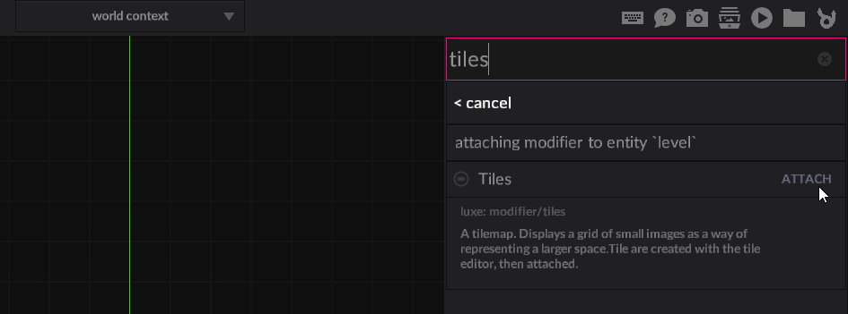

The tiles modifier is quite simple for now, it just has an asset selector to pick our tiles asset.

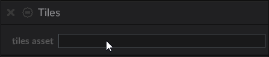

This will popup the asset selector for tiles, and we'll pick our tiles asset we just created.

Once selected, we'll see our tiles displayed in the world. Since our tiles are small I zoomed in quite a bit.

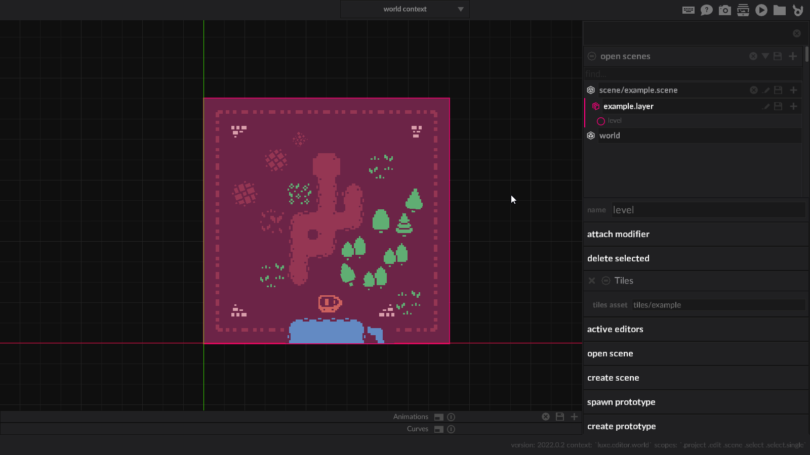

### transform the tiles

Since our entity is a regular entity, we can also attach a **Transform** modifier for repositioning, rotating, scaling the tilemap as a whole. It can also be integrated in our world, among the other entities we might have. Typically we create our world of things like triggers, colliders and spawn points and then mix our tilemaps in, or we can code our game to read info from the tiles instead. 

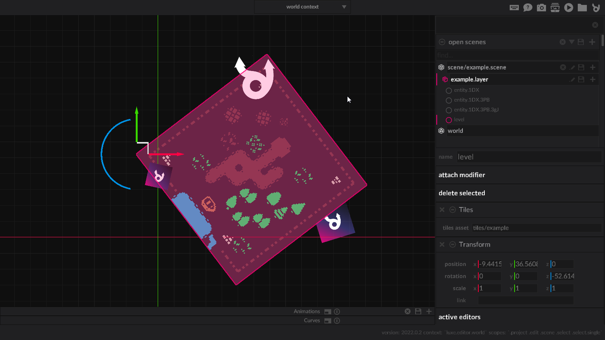

### duplicate and extend 

Also since our level is just an entity, we can use tiles as a visual tool. We can duplicate our tiles in the world, display multiple tiles assets side by side, and arrange our world as a whole, even if the parts are made up of individual, smaller patterns. 

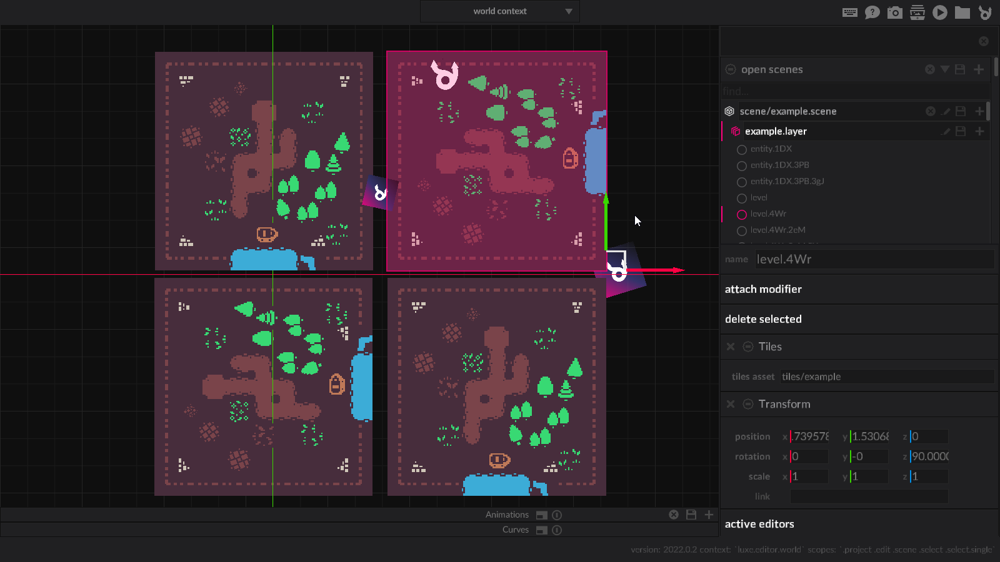

### layering

And one more interesting thing to note, our tiles have a depth and interact with the depth of the world as well. This may feel weird sometimes but it does allow some interesting behaviour, like you'll notice the water is obscured by the other tilemap when overlapped. This allows us to paint tiles assets in separate layers, and then combine them as a whole, say for example clouds. 

We might paint 3 tilemaps containing a few clouds. Then we can create several entities, each with a tiles modifier referencing one of the clouds, and then animate the clouds moving through our world. Since the clouds are in the same scene, they might be above or below the other entities in our scene. This gives us a lot of variation off of relative few assets, and we can mix and match content and code in a flexible way.

You might also just do the simpler background -> middle -> foreground as separate assets, allowing you to switch out the background or foreground layers dynamically, bringing more variety to a play through.

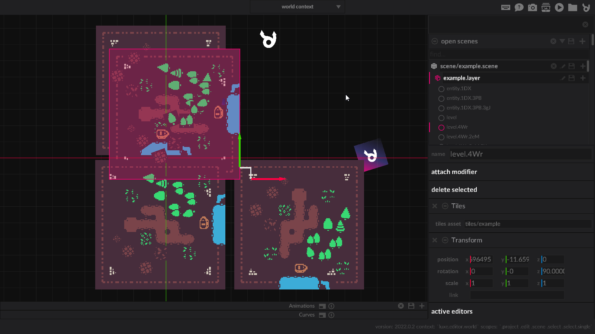

## live updates

When you have an instance of a tiles asset in the world, any changes saved in the tiles context will update the world context as well. This allows rapid iteration when working on the world as a whole, and iterating on tiles as layers. Use `ctrl + backtick` to quick-switch between editor contexts, which behaves like alt-tab in most OSs. 

## arcade tile collision

And finally, to add collision to a tiles, we'll use the Arcade modules. 
The details of [adding a module to a project](../../tutorial/using-modules) are in the full tutorial here.

Once you have arcade in your project, we'll be able to certain tiles that we choose into collidable arcade shapes automatically. You can see the result here, this is a level from the ld46 sample, where each red rectangle is a collision shape in arcade. We didn't have to make those manually.

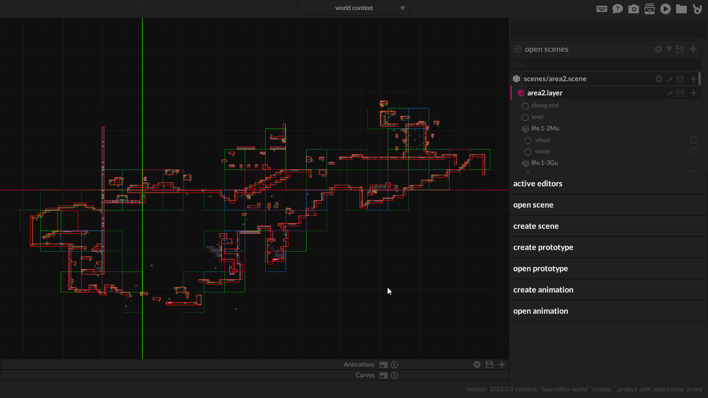

### Tagging tiles

In the tiles context, tiles can be assigned tags on the properties side bar in omni. They show in the stack info tooltip, as well as on the right. You can select multiple tiles and assign the same tag all at once. In this case, a region was selected and marked as solid. That's all you need! 

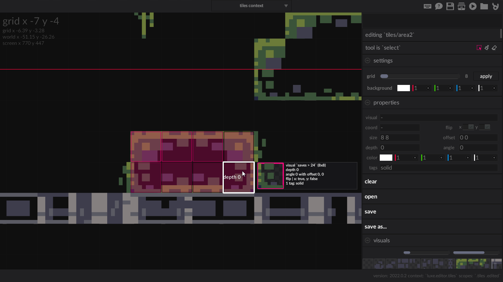

### Arcade Tiles Collision

Once you've tagged a tile, we **attach a Arcade Tiles Collision modifier** to the _same_ entity as our level/tiles instance in the world. This modifier asks us for one thing: a tag to convert to colliders. We can tell it to convert the `solid` tag we assigned above, and it will.

This also works with live updates, allowing iterating gameplay changes rapidly.

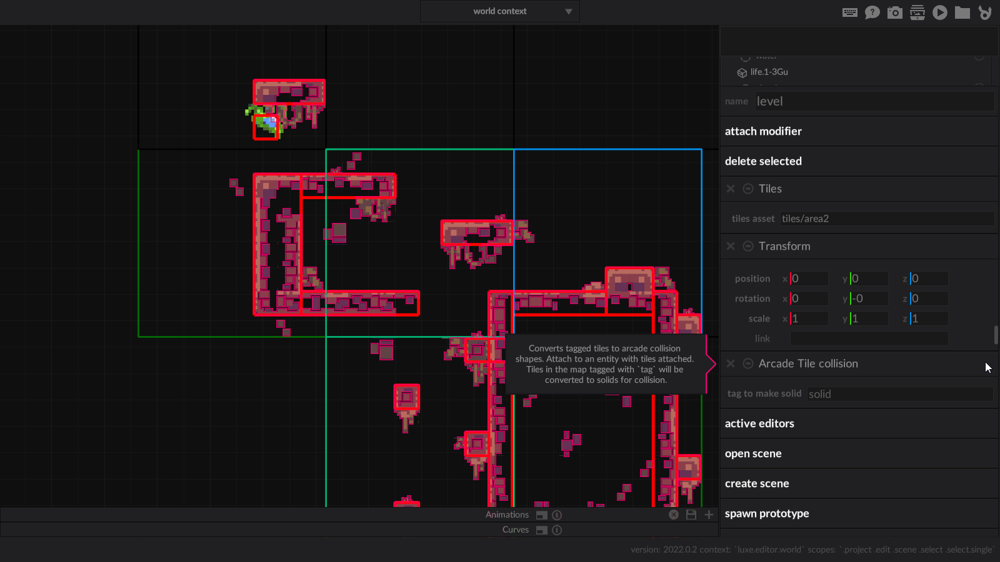

## done

That's it!

Tiles have plenty of todos but they can go a long way already.
