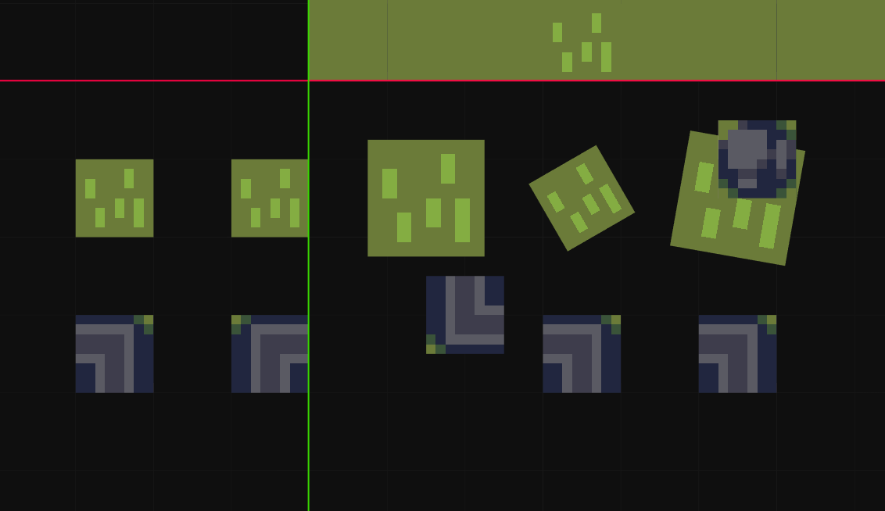
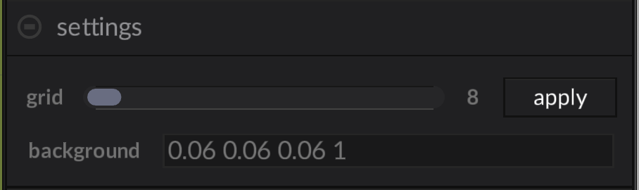
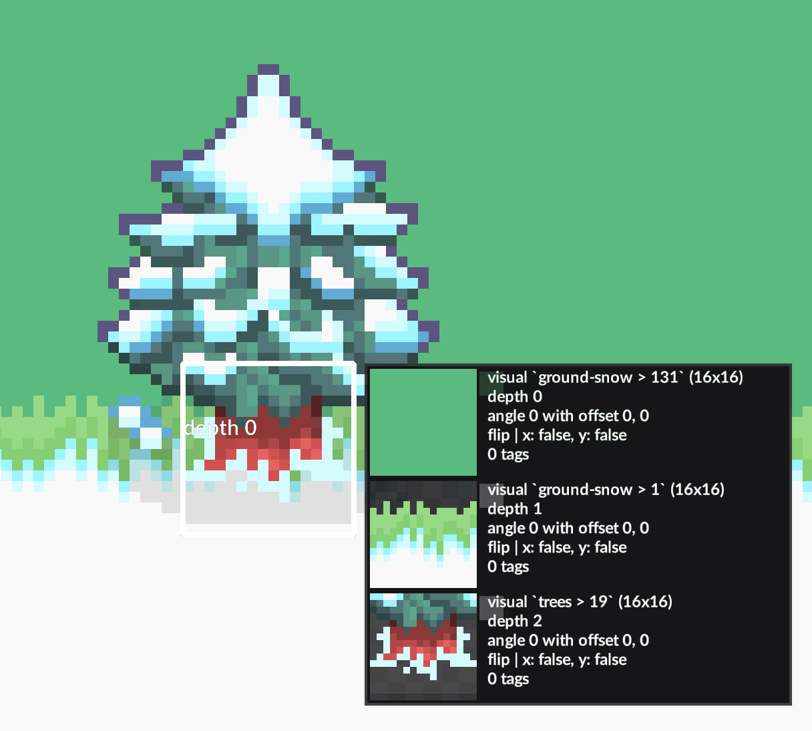
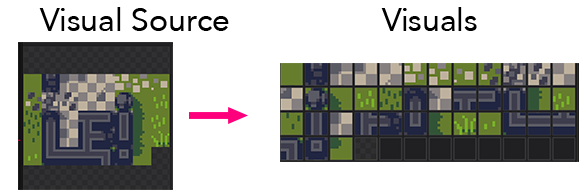
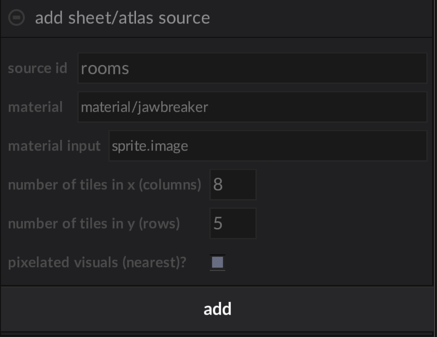
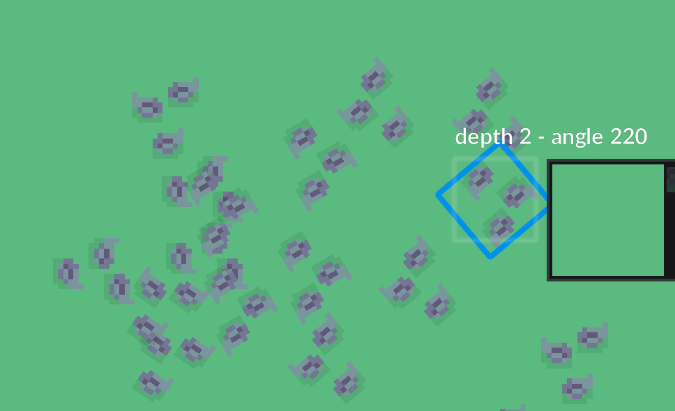
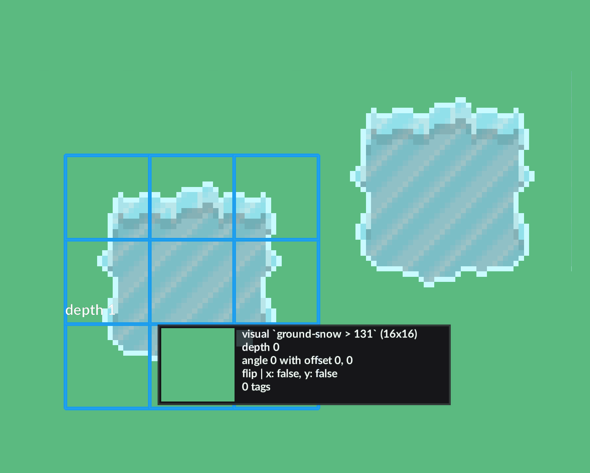
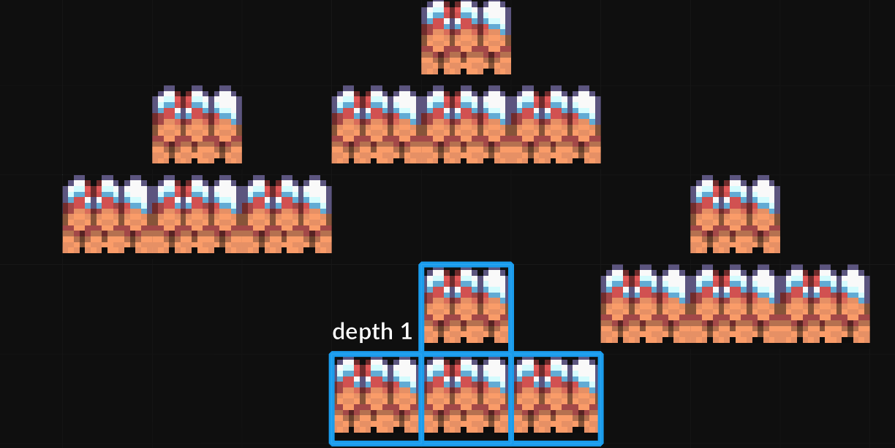
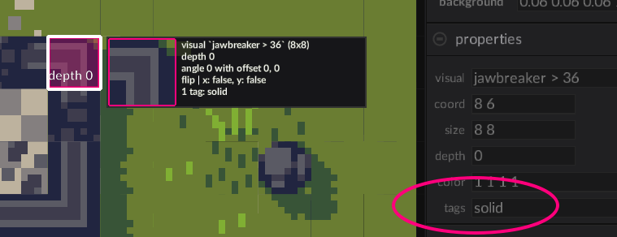
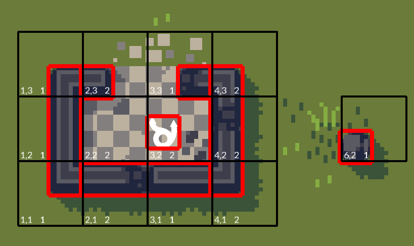

# Tiles Editor

## The Grid

Tiles live in a grid. In many classic games, the tile grid was stored as an array of tile indexes, and the engine would
render the tiles, allowing a large world without using very much memory. 

In Luxe, the grid is not required for rendering efficiency, but as a design constraint and tool. Many tricks and techniques
have been developed that take advantage of tilemap workflows, and they can be a powerful artistic and creative tool. Luxe
tilemaps let you use the tile grid as a design constraint without having to be limited to fixed size or placement.

There is no overall boundary for the tilemap grid. In fact a tile can be placed at negative coordinates. A tilemap is just 
a collection of tiles. Each cell in a tilemap can have a stack of multiple tiles at different _depths_, in that way
the map can be built of multiple layer of overlapping tiles.

{width="75%"}

Here's some examples of tiles on the grid: Tiles may be placed at negative coordinates, they may be flipped,
offset and scaled, and multiple tiles may be stacked in one tile space.

### Settings

The Settings panel in Omni defines the overall grid that the tiles use. 

{width="75%"}

You can change the grid size and press 'Apply' to apply the new size to the tile map. If the 
grid size is smaller than the tile size, tiles will overlap and if the grid size is larger,
gaps will appear.

- **Background Color** This sets the background color in the editor display.

### Inspector

When you hover the cursor over the tile map, it displays an inspector that lists all the tiles stacked
at the current location.

{width="75%"}

In this example there is a ground tile, a snow border tile, and a tree stump tile at this location. You can also
inspect the attributes such as flip and offset, and the `tags` for each tile in the stack.

#### Working with Depth

The cursor has a current depth. You can press `W` and `S`, or `Up Arrow` and `Down Arrow` to adjust the current depth,
or hold `SHIFT` and use the scroll wheel.

For tools that work with depth, such as _Select_ and _Erase_, you can hold `ALT` to apply the tool to all tiles in the
stack regardless of depth.

### Visual Sources

Each tile has a _Visual_ that comes from a _Visual Source_. Usually this is a tile 
sheet image, with the tiles layed out in a regular grid, but it could be a single image 
for one tile as well.  The tilemap can mix visuals from several visual source images in one map.

{width="75%"}

The visual source panel shows a preview of the visual sources, with sliders to control
the size and the background brightness for transparent images.

#### Adding a Visual Source

In the **Visual Source** panel in Omni, press "Add Visual Source". You can choose what type of source to add:

#### **sheet/atlas source** 

This adds tiles from an image with tiles arranged in a grid, often called a 'tile sheet', or 'atlas'. 

{width="50%"}

- **source id** - A unique name for the source. Tiles use this to identify which source they come from.
- **material** - The material with which the tiles will be rendered.
- **material input** - Normally not changed. If your material uses a different image name, set it here.
- **number of tiles in x (columns)**
- **number of tiles in y (rows)** 
- **pixelated visuals** - Whether the tilemap should be displayed with sharp pixels in preview and tile palette.

#### **image source**

Adding an image source will make a visual source with a single image. The visual size will be detected automatically
from the image.

### Brushes

Painting on the tilemap is done with **Brushes**. A brush is a group of tiles arranged together. For example, if you
had a 2x2 tuft of grass, you could have a brush with 4 tiles.

In the simplist case, a brush is just a single tile. 
Choose the Brush tool from the tools, then click in the tile visuals to select a single tile brush this way.

#### Painting Offset, flip and rotation

When painting, you can press `F` and `V` to flip the brush horizontally or vertically. 

You can hold `R` and drag the mouse up and down to rotate the tile. Holding `Shift` will snap the rotation to even
multiples.

Painting offset tiles can be a little confusing but it is a powerful tool. If you hold down `alt` or `option` on mac,
the brush will no longer be snapped to the grid, and you can paint anywhere. However, keep in mind that this doesn't
actually paint freehand, it is assigning the tile to the nearest grid square as usual, but then setting the offset 
to the brush position. So if you offset several tiles nearby at the same depth, it may sometimes look like it is erasing
tiles that are already placed, but it is really just replacing the tile with a different offset.

!!! note ""
	Painting offset tiles at different depths lets you cover a lot of area.

{width="50%"}

Rotating and offset tiles are extremely useful, especially to add variation to decals and avoid the repeated look.

### Multi-tile brushes

To define a more complicated brush, hold down `Shift` and select multiple tiles from the visual list. It is
helpful to use the size slider to make the rows/cols match your source. 

{width="50%"}

Now, when you paint with the brush tool, the set of tiles will be stamped as a single unit.

{width="50%"}

#### Stamping Tiles

You can use the editor window like a scratchpad to define a compound brush. 

To do this, hold down `CTRL` when drawing tiles on the main editor screen. You can
draw the tile in any pattern or configuration. The tiles will appear on top of
the existing map, and be drawn with a blue highlight.

{width="50%"}

Then, when you release `CTRL`, the tiles will not be stamped on the map but instead
be used at the current brush.

<video preload="auto" controls="" loop="loop" style="max-width:90%; width:auto; margin:auto; display:block;">  
  <source src="https://cdn.discordapp.com/attachments/812866241160282113/869652360685813781/PRlqr7qhm2.mp4" type="video/mp4"></source>
</video>

!!! warning
    I'm not sure how to properly handle the videos here. I just dropped a link to the copy from
	discord's CDN but you might want to move these. :)

You can even repeat this and hold `CTRL` and stamp the brush to make a larger brush, to
build up larger and more complicated shapes! And using the Flip (`F` and `V`) commands work on the
entire brush.

#### From the Map

You can also grab a brush from the map. In `Select` mode, select some tiles. You can hold `CTRL` to select
a rectangular region, or `SHIFT`-select multiple tiles. Then press Copy (`CTRL-V` or `Cmd-V`) to make a brush
from them. This will automatically switch to the the Brush tool.

You can even combine these approaches to quickly build up levels. 

<video preload="auto" controls="" loop="loop" style="max-width:90%; width:auto; margin:auto; display:block;">  
  <source src="https://cdn.discordapp.com/attachments/812866241160282113/869653801798344735/1TeiHli4vC.mp4" type="video/mp4"></source>
</video>

### Setting Tags

You can add tags to tiles which can be read by other gameplay modules. 

{width="50%"}

In this example, the runtime looks for the `solid` tag to provide collision information that we can see in the debug overlay:

{width="50%"}

### Erasing tiles

The `E` Key activates the Erase tool. This erases tiles at the current depth. 

